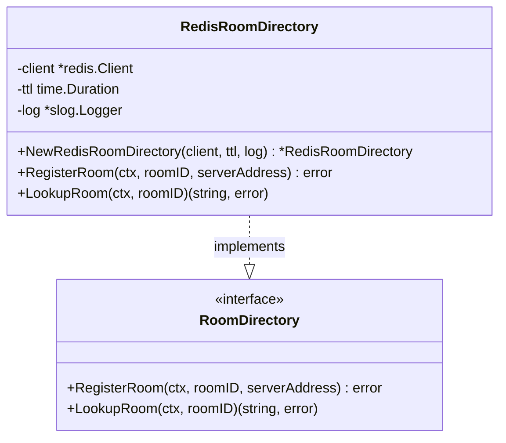
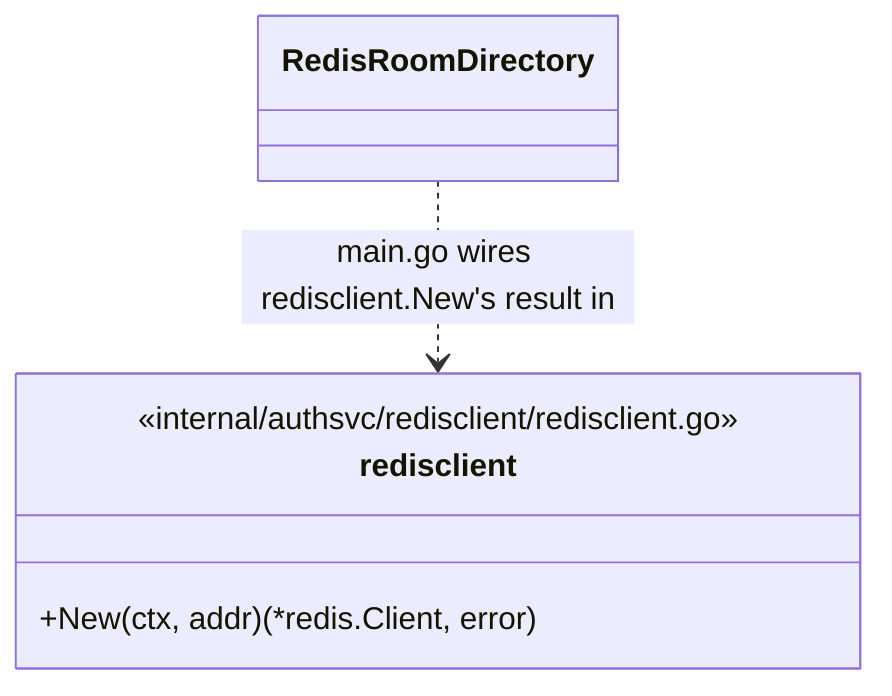
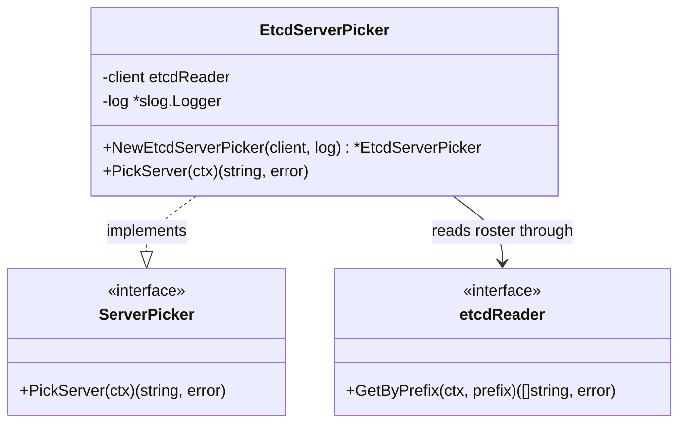
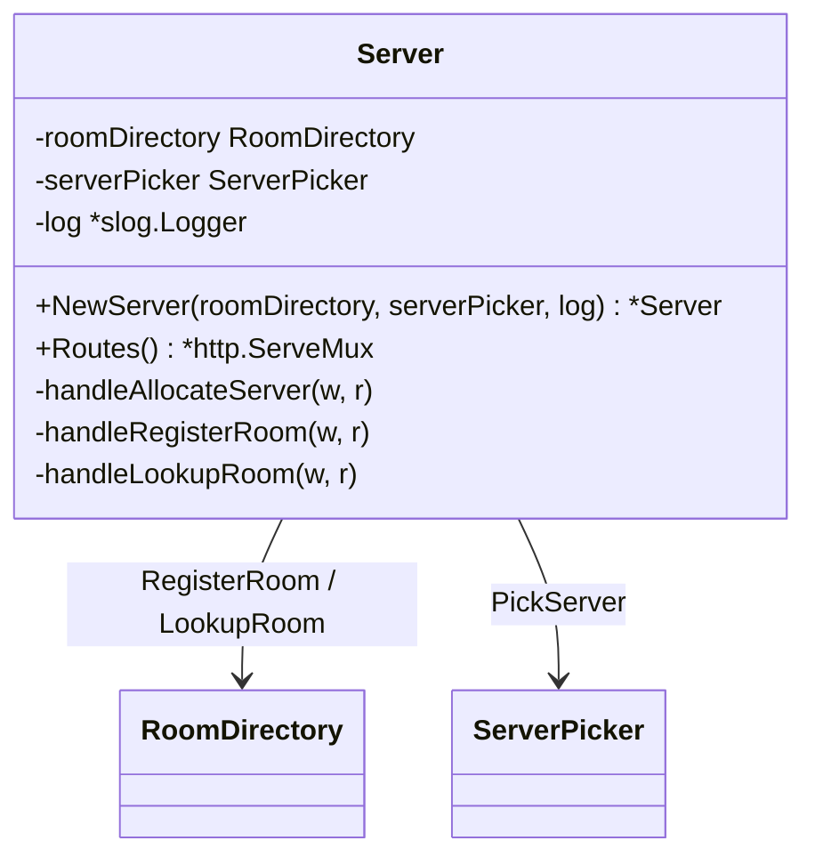
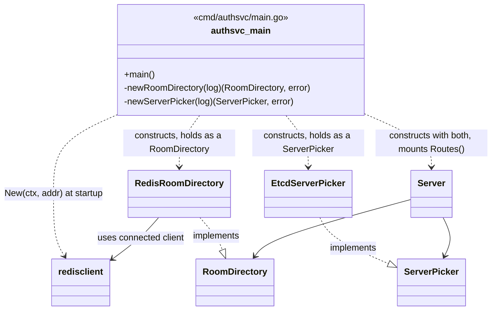

# authsvc — Class Diagrams

One consolidated view of every struct/interface in authsvc so far and how
they link together. Individual per-class docs (purpose + method
descriptions) live in
`cabo-bmad/_bmad-output/implementation-artifacts/architecture/`.

authsvc is scoped, for now, to room-allocation only — no login/auth/user
identity work yet (see `cmd/authsvc` note in `../../CLAUDE.md`). The
room-creation handoff this package supports is recorded as AD-9 in the
shared spine.

## internal/authsvc/roomdirectory — room-id to server-address lookup

`RoomDirectory` is an interface, not a concrete store: callers depend only
on it, never on Redis directly, so the backing store can be swapped later
(e.g. to a SQL/NoSQL store) by writing a new implementation and changing
one constructor call in `main.go`. `RedisRoomDirectory` is the current
implementation, and depends on `internal/authsvc/redisclient` for its
connection.

## internal/authsvc/redisclient — Redis connection setup

Not a class — a package-level function for bare connection setup, kept
separate from `roomdirectory` so "how to connect" and "what operations we
need" stay independent concerns.

## internal/authsvc/serverpicker — pick a live roomsvc server

`ServerPicker` is an interface, same reasoning as `RoomDirectory`: callers
never depend on etcd directly. `EtcdServerPicker` reads the same
`/roomsvc/servers/` roster that roomsvc's `Registrar` writes (spine AD-7).
No placement policy is decided yet — it returns the first registration
found.

## internal/authsvc/api — HTTP controller layer

`Server` implements the AD-9 handoff as three HTTP endpoints, depending
only on `RoomDirectory` and `ServerPicker` — never on Redis/etcd directly.

| Endpoint | Method | AD-9 step | Notes |
| --- | --- | --- | --- |
| `/rooms/allocate` | POST | 1 | Client asks for a server to create a room on. No room/ID exists yet. |
| `/rooms/register` | POST | 3-4 | roomsvc reports a room it just created; writes the Redis entry. |
| `/rooms/{roomID}` | GET | second-player join | Client asks for an existing room's server by ID. |

## How it all fits together

`main.go` connects to Redis and etcd, constructs `RedisRoomDirectory` and
`EtcdServerPicker`, and hands both to `api.Server` purely as their
interfaces (`RoomDirectory`, `ServerPicker`) — the HTTP layer never knows
which concrete store or discovery mechanism is behind them.

## Not yet built

- Login/auth/session logic — out of scope for the current work; see
  `../../CLAUDE.md`.
- A real placement policy for `EtcdServerPicker.PickServer` (spine AD-7
  leaves this explicitly undecided). It currently always returns the first
  registration found — one server absorbs every new room, the rest sit
  idle, and the decoded `capacity` field is never read. Marked with a
  `// TODO` in `etcd.go`. Candidate fix, once room-closure reporting exists
  (roomsvc → authsvc, planned): authsvc tracks live room counts per server
  itself by watching room-created/room-closed events, and picks the
  least-loaded one — no roomsvc-side registration change needed. Simpler
  interim options: round-robin, or weight by the existing static
  `capacity` value.

## Contract with roomsvc's authclient

`internal/roomsvc/authclient` is the caller of `POST /rooms/register`
(built and wired independently, on the roomsvc side). As of this writing
the two sides agree exactly: path (`/rooms/register`), method (`POST`),
and body shape (`{"room_id": "...", "server_address": "..."}`, same JSON
tags on both structs). If either side changes this contract, re-verify the
other and update this note.
