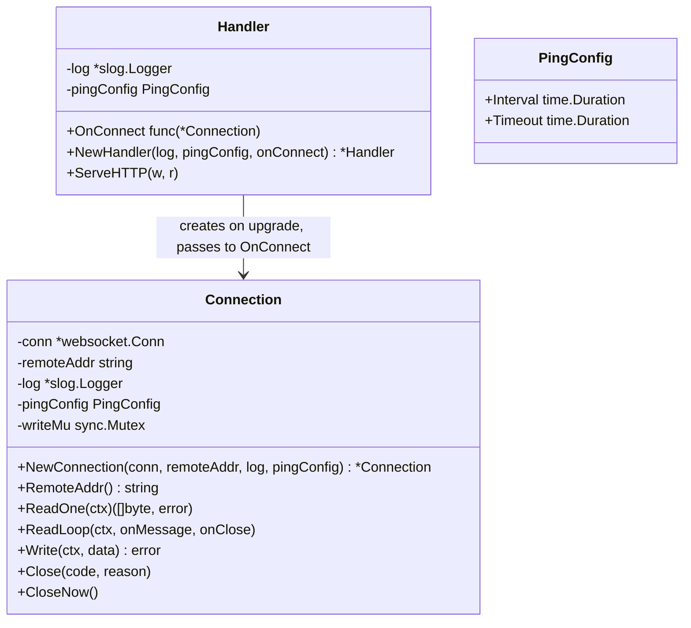
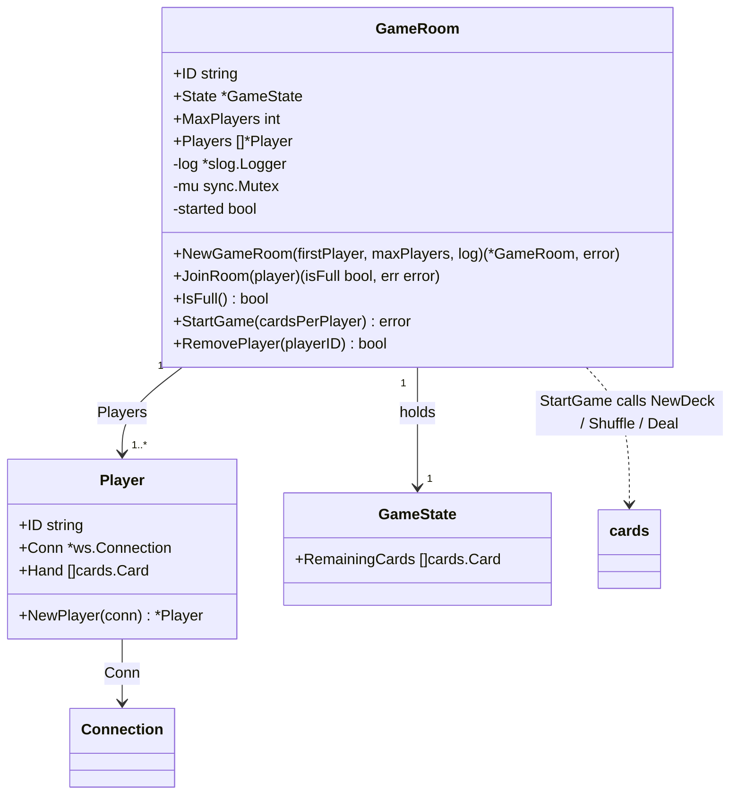
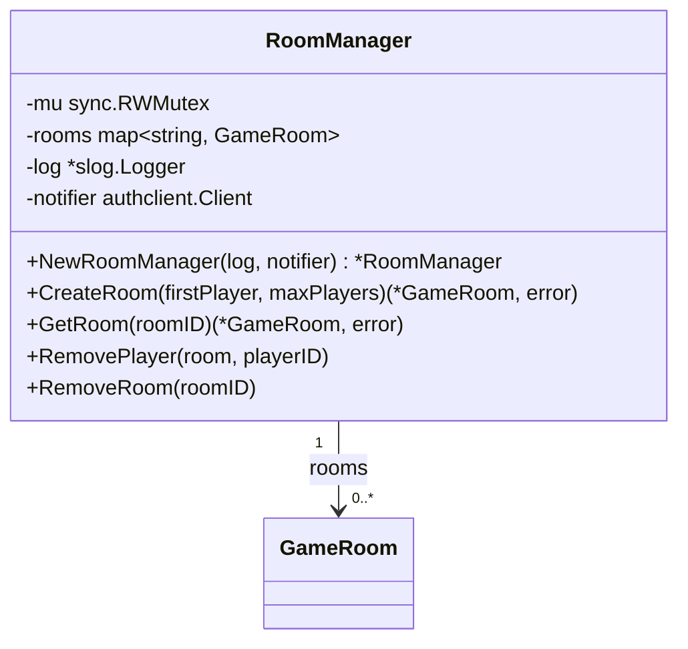
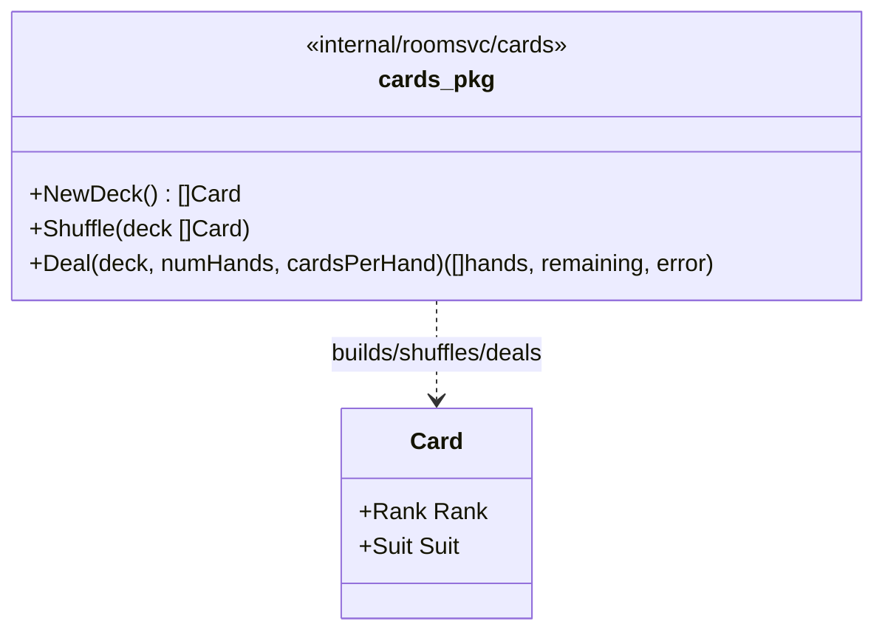
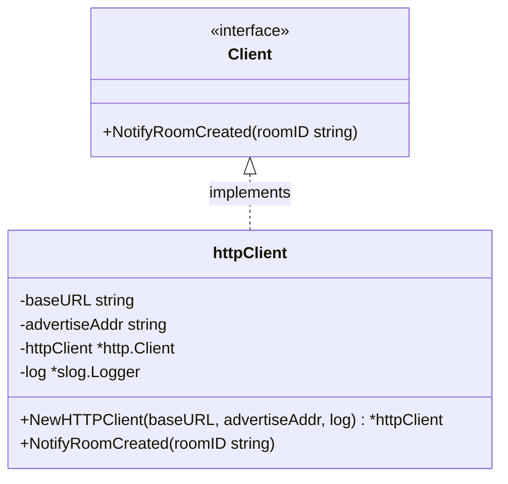
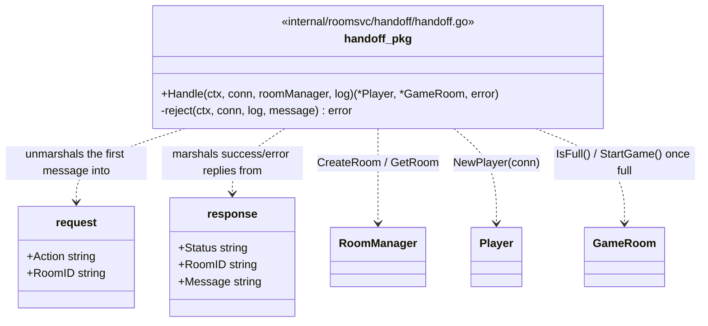
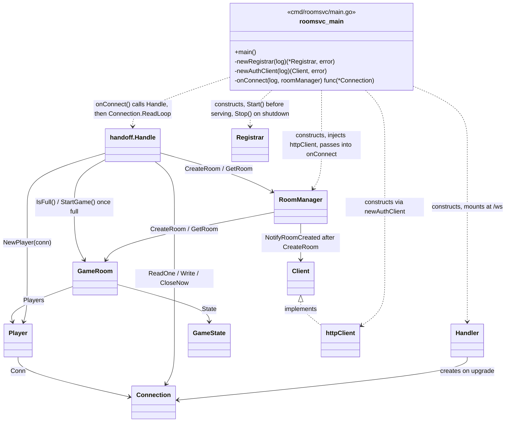
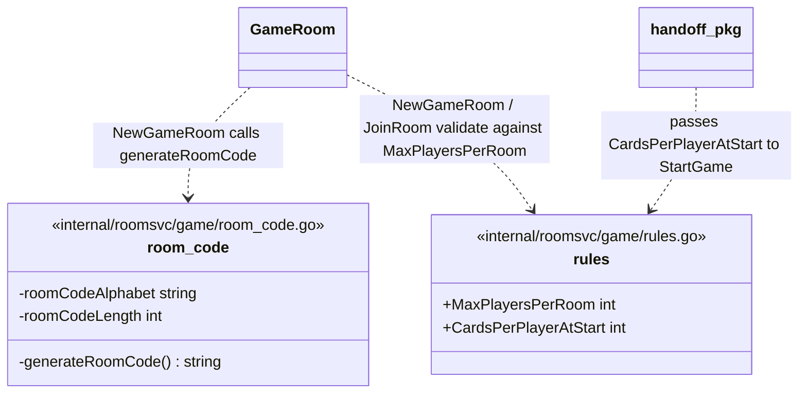

# roomsvc — Class Diagrams

One consolidated view of every struct in roomsvc so far and how they link
together. Individual per-class docs (purpose + method descriptions) live in
`cabo-bmad/_bmad-output/implementation-artifacts/architecture/`.

roomsvc is split into six packages: `ws` (WebSocket transport), `game`
(game domain), `cards` (standard 52-card deck mechanics), `registry` (etcd
liveness), `authclient` (authsvc notification), and `handoff` (the
WebSocket create/join handshake, layered above both `ws` and `game`).
Dependencies only point one way — `game` imports `ws` for `Player.Conn`
and `cards` for `Player.Hand`/`GameState.RemainingCards`; `handoff`
imports both `ws` and `game`; none of `ws`, `game`, `cards`, `registry`,
or `authclient` import `handoff`; `cards` imports nothing from `game`.

## internal/roomsvc/ws — WebSocket transport

Has no knowledge of game rules or room state. `Handler` initiates a
connection; `Connection` owns everything about it afterward (read, write,
close).



`ReadOne` reads exactly one message and returns it, without closing the
connection on success — added for `handoff` (below) to inspect the first
message before deciding what happens next. It shares frame-reading and
error-classification with `ReadLoop` via a private `readFrame` helper, so
both apply the same context-cancellation handling (see `ReadLoop`'s doc
comment: `coder/websocket`'s `Read` doesn't reliably unblock on `ctx`
cancellation, so both watch `ctx` and force-close instead).

`Close` performs a full WebSocket close handshake and waits up to 5s for
the peer to send back its own close frame — appropriate when ending a
connection the peer might still want to gracefully wind down (e.g. server
shutdown). `CloseNow` skips that handshake entirely; use it when the peer
already has no reason to cooperate — e.g. it was just told why the
connection is ending through an application-level message, so there's
nothing to wait for. This distinction mattered in practice: `handoff`
(below) originally called `Close` right after writing a rejection, and its
tests hung for exactly the wait `Close` documents, because the test client
never sent a close frame back.

`ReadLoop`'s `onClose` runs exactly once after the loop ends for any reason
(client close, read error, `ctx` cancellation, or a ping timeout — see
below) — the seam for a caller to release whatever it associated with the
connection while the loop was running (e.g. seating a player in a room),
without `ws` needing any knowledge of what that association is.
`cmd/roomsvc/main.go`'s `onConnect` uses it to call `RoomManager.RemovePlayer`,
so a dropped connection no longer leaves a stuck seat in its room.

`ReadLoop` also runs a ping/pong keepalive for the life of the loop
(`pingLoop`, unexported), configured by the `PingConfig` passed to
`NewConnection`/`NewHandler`. This detects a peer that has gone silent
without a normal WebSocket close — e.g. a network partition — which a
plain read error can't catch: a dead-but-silent TCP connection blocks
`Read` forever instead of erroring, so nothing before this would ever
notice. `pingLoop` sends a ping every `PingConfig.Interval` and calls
`CloseNow` if a pong isn't observed within `PingConfig.Timeout`; that
unblocks the stuck `Read` the same way any other close does, so `ReadLoop`
returns through its normal path and `onClose` still fires.
`coder/websocket`'s `Ping` only completes once the peer's pong is observed
by an in-progress `Read` on the same connection, so `pingLoop` must run
concurrently with the read loop — `ReadLoop` starts it as a sibling
goroutine scoped to the same `ctx`, never before or after. `cmd/roomsvc/main.go`
reads `PingConfig.Interval`/`Timeout` from `ROOMSVC_PING_INTERVAL`/
`ROOMSVC_PING_TIMEOUT` (defaults 30s/10s), via `newPingConfig`.

## internal/roomsvc/game — game domain

`GameRoom` is one game's authoritative state. It cannot be constructed
without at least one `Player` already seated. `Player` wraps a `Connection`
with player identity, keeping transport and identity separate. `GameState`
holds shared round state — currently just the draw pile
(`RemainingCards`); card values, special powers, and turn/round state are
still deferred to the game-logic spec (architecture spine).



`NewPlayer` generates a random, opaque ID for the player (`generatePlayerID`,
128 bits via `crypto/rand`) — not authentication, just enough to
distinguish players within this instance's rooms. Real player identity is
a separate, undecided design effort. Existing tests still construct
`Player{ID: "..."}` literals directly where a fixed, predictable ID is
more convenient for assertions; `NewPlayer` is for real connections, via
`handoff` (below).

`JoinRoom`'s `isFull` return value is computed under the same lock as the
seat assignment, so it can't go stale between the join and the caller
checking it — the caller (`handoff`, below) uses it to decide whether to
call `StartGame`. `IsFull` exists separately for the one case `JoinRoom`
can't cover: a room created with `maxPlayers=1` is already full the
instant `NewGameRoom` seats its first player, with no `JoinRoom` call ever
happening for it.

`StartGame` deals `cardsPerPlayer`-sized hands to every seated player from
a freshly shuffled `cards.NewDeck()`, assigns each hand to its `Player`,
and stores what's left as `State.RemainingCards`. It can only run once per
room (guarded by `started`) — Cabo has no re-dealing mid-game, so a second
call is an error rather than a silent no-op or a fresh reshuffle.

`RoomManager` holds every `GameRoom` currently live on this instance, keyed
by room ID — it is how a room created for player 1 gets found again when
player 2 joins.



`RemovePlayer` removes a player from its room via `GameRoom.RemovePlayer`
and, if that empties the room, calls `RemoveRoom` to drop it from this
instance's registry too — the current, narrow rule for when a room goes
away. `RemoveRoom` is its own method (not folded into `RemovePlayer`)
because other, not-yet-designed triggers (e.g. a game ending with players
still connected) will need to remove a room without a player disconnect.
`cmd/roomsvc/main.go`'s `onConnect` calls `RemovePlayer` from `ReadLoop`'s
`onClose` hook.

## internal/roomsvc/cards — standard 52-card deck mechanics

Pure card/deck logic: no knowledge of `GameRoom`, `Player`, or Cabo's game
rules (card values, special powers — still undecided, see
`cabo-bmad/docs/cabo.md`). Kept as its own package for the same reason as
`ws` vs `game`: a self-contained unit with no reason to know about room or
connection lifecycle, so it can be tested in total isolation.



`NewDeck` returns a fixed, unshuffled 52-card deck (4 suits x 13 ranks, no
jokers — see `cabo-bmad/docs/cabo.md`, "Decisions"). `Shuffle` randomizes a
deck in place with Fisher-Yates, using `crypto/rand` rather than
`math/rand`: a predictable shuffle would let a player predict the deck's
remaining order, the same reasoning this codebase already applies to room
codes and player IDs. `Deal` distributes `cardsPerHand` cards to each of
`numHands` hands in contiguous blocks (hand 0 gets the first block, hand 1
the next, and so on — not round-robin), and returns whatever's left of the
deck as the remaining draw pile; it errors, dealing nothing, if the deck
doesn't have enough cards.

## internal/roomsvc/registry — etcd liveness registration

Wraps etcd's lease mechanism so the rest of roomsvc never touches etcd
directly (spine AD-7). No knowledge of `GameRoom` or `Player`. `Registrar`
depends on the small `etcdClient` interface, not `*clientv3.Client`
directly — `clientv3.Lease`/`clientv3.KV`'s `Put` takes an opaque
`OpOption` with no public way to read a lease ID back out, which makes it
untestable without a real etcd server. `etcdClient` instead takes a plain
`leaseID` argument; `clientv3Adapter` is the only real implementation,
translating to `clientv3.WithLease` underneath. Tests fake `etcdClient`
directly — no etcd server involved (same pattern as
`authsvc/roomdirectory.RoomDirectory`).

One `Registrar` per process: grants a lease, writes this instance's
address+capacity under it, and keeps the lease alive for as long as the
process runs. If the keepalive stream ever closes (etcd unreachable, lease
lost), it re-registers under a new lease with jittered exponential backoff
instead of leaving the instance permanently unregistered. See the shared
LLD (`roomsvc Registration & Heartbeat LLD`) for the full lease lifecycle
and TTL choice.

```mermaid
classDiagram
    class etcdClient {
        <<interface>>
        +Grant(ctx, ttlSeconds) (leaseID, error)
        +Put(ctx, key, val, lease) error
        +KeepAlive(ctx, lease) (~chan struct~{~}~, error)
        +Revoke(ctx, lease) error
    }

    class clientv3Adapter {
        -client *clientv3.Client
        +NewClientv3Adapter(client) etcdClient
    }

    class Registrar {
        -client etcdClient
        -advertiseAddr string
        -capacity int
        -leaseTTL time.Duration
        -log *slog.Logger
        -leaseID leaseID
        -cancel context.CancelFunc
        -done chan struct~{~}~
        +NewRegistrar(client, advertiseAddr, capacity, leaseTTL, log) *Registrar
        +Start(ctx) error
        +Stop(ctx) error
    }

    etcdClient <|.. clientv3Adapter : implements
    Registrar --> etcdClient : Grant / Put / KeepAlive / Revoke
```

`Start` blocks until the first successful `Put` so `main.go` knows
registration succeeded before serving WebSocket traffic; the keepalive and
re-registration loop then continues in a background goroutine
(`keepAliveLoop`) for the life of the process. `Stop` cancels that
goroutine, waits for it to exit, then revokes the lease explicitly so the
registration disappears immediately on a graceful shutdown, instead of
waiting out the TTL.

## internal/roomsvc/authclient — authsvc notification

Thin HTTP client, also with no knowledge of `GameRoom` or `Player`: it
takes a room ID and reports it to authsvc's `POST /rooms/register`
(`internal/authsvc/api`) so authsvc can write the room-id →
server-address entry in Redis (spine AD-3 reserves that write for the
stateless tier — roomsvc cannot do it directly). Calls are fire-and-forget
from the caller's side: `NotifyRoomCreated` starts a goroutine and returns
immediately, and never returns an error, since an authsvc outage must not
affect roomsvc's ability to create rooms (spine AD-6, independent tiers).
Each notification is retried on its own with jittered exponential backoff
until it succeeds.

The LLD this package implements ("roomsvc Registration & Heartbeat LLD")
originally specified batching notifications (flush at 2 pending or a short
linger timeout) against an assumed `POST /internal/v1/rooms` array
endpoint. Once `internal/authsvc/api.handleRegisterRoom` was actually built
(a single-object body, `204 No Content`, path `/rooms/register`), batching
was dropped in favor of matching the real contract — one HTTP request per
`NotifyRoomCreated` call. If a genuine need for batching resurfaces, it
would require a coordinated change to the authsvc endpoint too, not just
this client.



`Client` is an interface — not because roomsvc has more than one caller,
but so `RoomManager`'s tests can pass a fake instead of making a real HTTP
call (a test seam; see the LLD for the full reasoning). `httpClient` is the
only real implementation. `advertiseAddr` is the same value passed to
`registry.NewRegistrar` — this instance's own externally-reachable
address, sent alongside every room ID.

`RoomManager` takes a `Client` in its constructor and calls
`NotifyRoomCreated` after registering a newly created room (see
`internal/roomsvc/game`, above). Both `RoomManager` and `httpClient` are
now constructed in `cmd/roomsvc/main.go` (`newAuthClient` reads
`ROOMSVC_ADVERTISE_ADDR` and `AUTHSVC_INTERNAL_ADDR`, builds the
`httpClient`, and hands it to `game.NewRoomManager`); `RoomManager` itself
is threaded into `onConnect` as a constructor parameter, ready for when
WebSocket-to-room assignment is decided, but `onConnect` does not call any
of its methods yet — room assignment onto WebSocket connections is still a
deferred spine item.

## internal/roomsvc/handoff — WebSocket create/join handshake

Every new WebSocket connection performs a one-message handshake before it
joins the normal game message flow: the client says whether it wants to
create a new room or join an existing one, and roomsvc replies once with
the outcome. This implements roomsvc's half of spine AD-9's client-driven
handoff. The exact wire format was previously listed in the shared spine's
"Deferred" list ("Exact WebSocket message/protocol contract between
client and backend") — it was decided pragmatically here, since no client
existed yet to have assumed something else, and is recorded below as the
agreed contract.

### Message contract

The client sends exactly one JSON message immediately after the
connection opens:

```jsonc
// Create a new room:
{"action": "create_room"}

// Join an existing room:
{"action": "join_room", "room_id": "K7XQPT9M"}
```

roomsvc replies with exactly one JSON message:

```jsonc
// Success:
{"status": "ok", "room_id": "K7XQPT9M"}

// Failure (unknown action, invalid JSON, unknown room, full room, etc.):
{"status": "error", "message": "roomsvc: room K7XQPT9M is full (max 4 players)"}
```

An explicit `"action"` field was chosen over inferring intent from
`room_id` being present/absent/empty — the latter is ambiguous in JSON
(missing field? empty string? `null`?) and less self-documenting in logs.

On success, the connection stays open and continues into the normal
`ReadLoop`. On failure, roomsvc has already closed the connection (via
`CloseNow` — see the `ws` section above for why not `Close`); there is
nothing further to send or read.

After a successful create or join, `Handle` checks whether the room is now
full — `GameRoom.IsFull()` after a create (covers a `maxPlayers=1` room,
already full with just its first player), or the `isFull` `JoinRoom`
returned after a join — and calls `GameRoom.StartGame(game.CardsPerPlayerAtStart)`
if so. This is the "minimum players to start" decision from
`cabo-bmad/docs/cabo.md`: for now, a game starts exactly when its room
fills, not before. A `StartGame` failure is logged but does not fail the
handoff response the player already received — dealing cards is a
follow-on step, not part of the create/join contract itself.



`Handle` reads exactly one message via `Connection.ReadOne`, decides
`create_room` vs `join_room`, calls `RoomManager` accordingly, and writes
back the outcome. On success it returns the `*Player` and `*GameRoom` so
the caller (`cmd/roomsvc/main.go`'s `onConnect`) can log context and
continue with `conn.ReadLoop`. It depends on both `ws` and `game` (a new
layer above them, not touched by either) and has no dependency back from
either into it.

## How it all fits together



A client connects over WebSocket (`Handler` → `Connection`). `onConnect`
immediately calls `handoff.Handle`, which reads the client's create/join
message and calls `RoomManager.CreateRoom` (seating a new `Player` as the
first occupant of a new `GameRoom`) or `RoomManager.GetRoom` +
`GameRoom.JoinRoom` (seating a new `Player` into an existing one) —
spine AD-6/AD-7's deferred "room assignment" question is now answered by
`handoff`'s message contract (see above). `CreateRoom` also calls
`Client.NotifyRoomCreated` so authsvc learns the new room's address; this
never blocks or fails room creation itself. Once the room fills, `handoff`
also calls `GameRoom.StartGame`, which deals opening hands from the
`cards` package. On success, `onConnect` continues into `conn.ReadLoop`
for whatever comes next (actual gameplay message routing — not built yet,
a separate task). Independently of all of this, `Registrar` keeps the
process's own liveness lease renewed in etcd for as long as roomsvc runs.
`Registrar`, `RoomManager`, the `authclient.httpClient` it wraps, and now
the handoff handshake are all constructed and running end-to-end in
`main.go`.

## Non-class files

Two files have no struct/class to diagram — they hold package-level
functions and constants instead. Listed here so every file in the package
is accounted for; see their docs in
`cabo-bmad/_bmad-output/implementation-artifacts/architecture/` for details.


