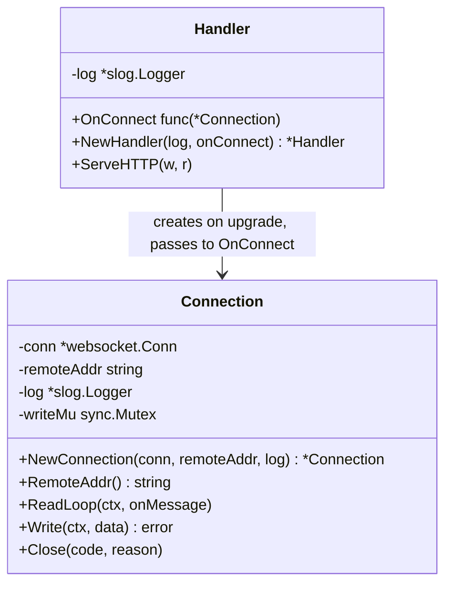
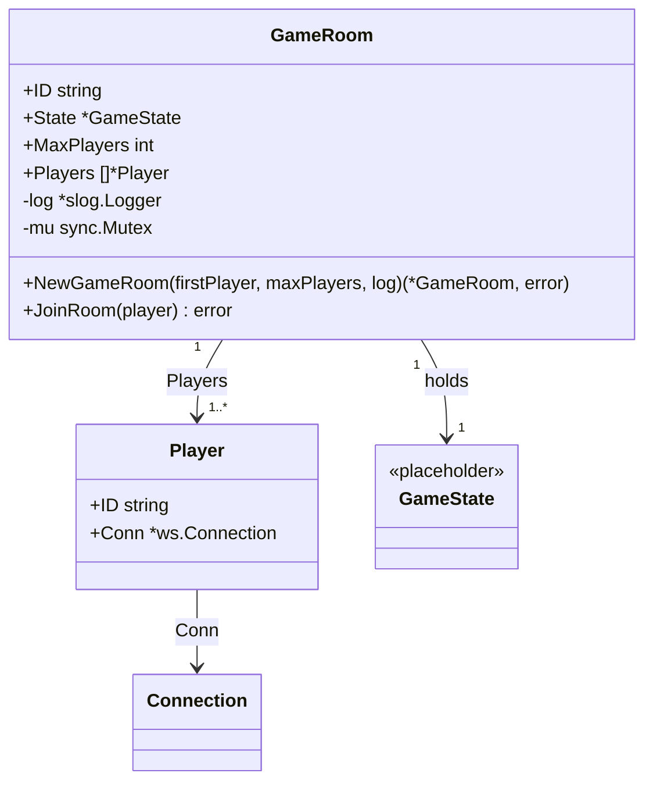
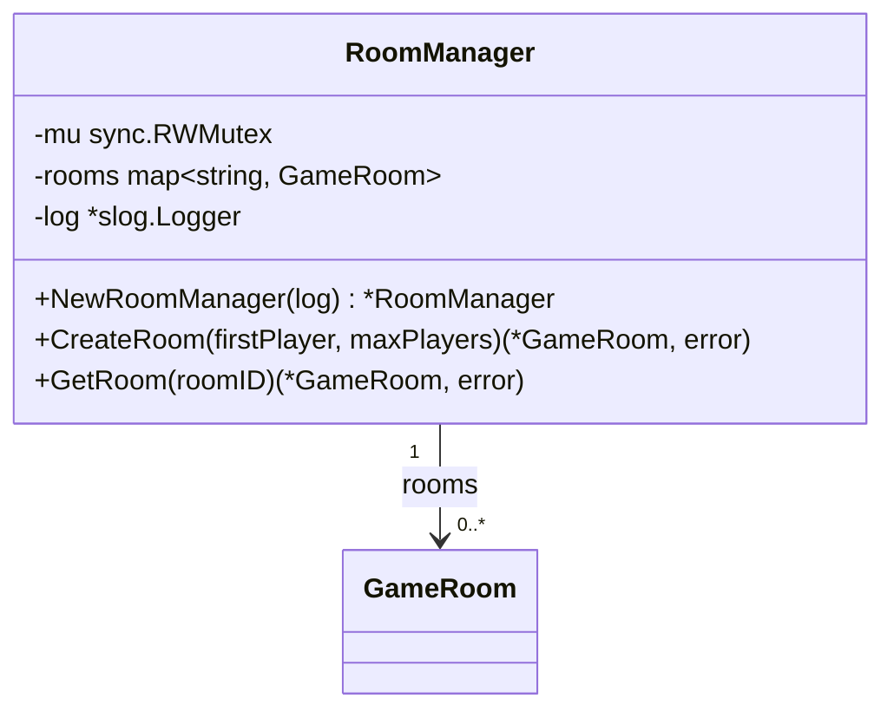
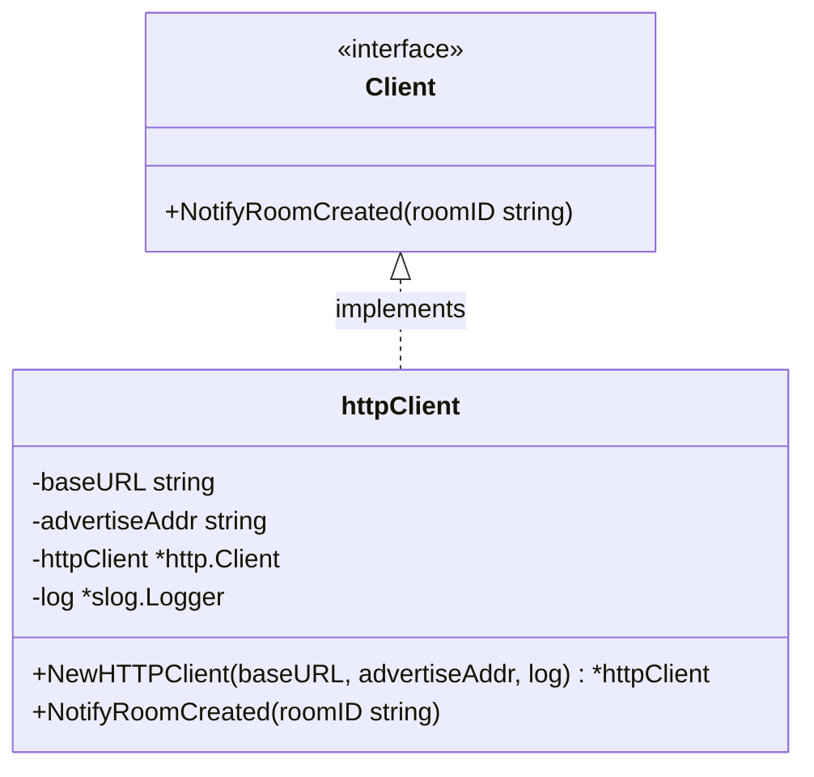
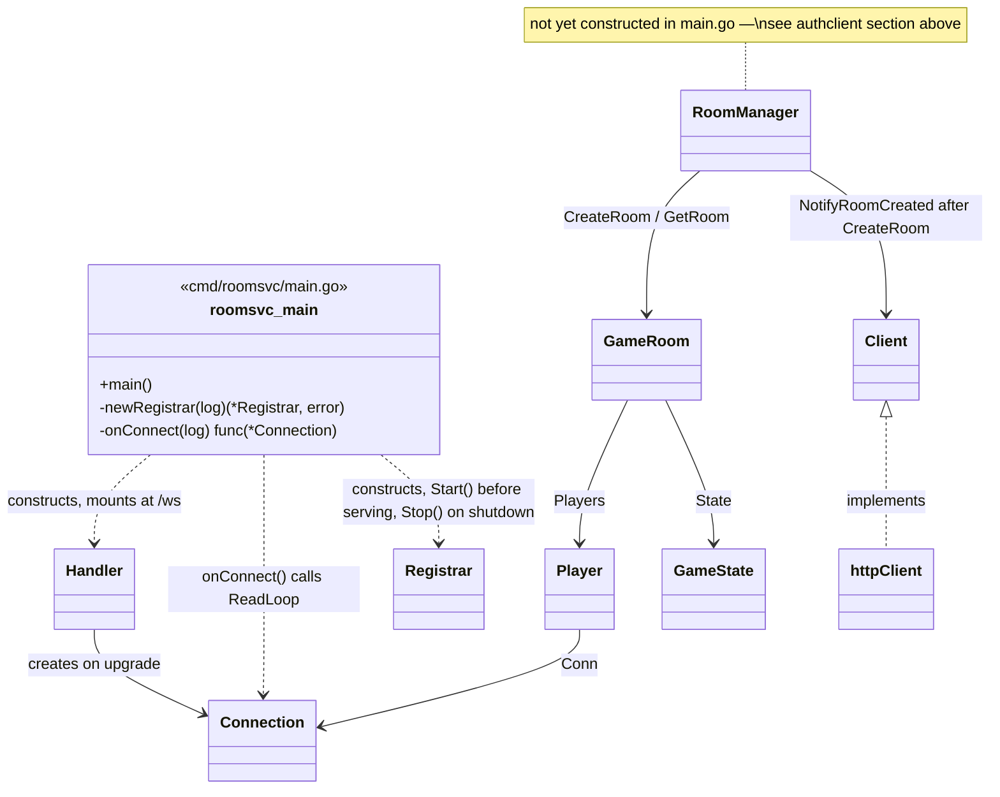
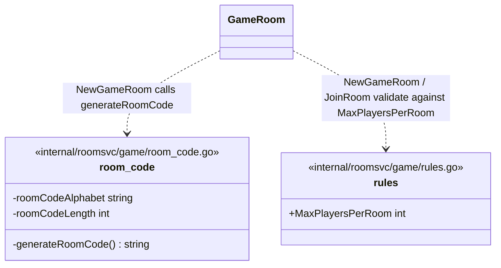

# roomsvc — Class Diagrams

One consolidated view of every struct in roomsvc so far and how they link
together. Individual per-class docs (purpose + method descriptions) live in
`cabo-bmad/_bmad-output/implementation-artifacts/architecture/`.

roomsvc is split into two packages: `ws` (WebSocket transport) and `game`
(game domain). `game` imports `ws` for `Player.Conn`; `ws` has no
dependency back on `game`.

## internal/roomsvc/ws — WebSocket transport

Has no knowledge of game rules or room state. `Handler` initiates a
connection; `Connection` owns everything about it afterward (read, write,
close).



## internal/roomsvc/game — game domain

`GameRoom` is one game's authoritative state. It cannot be constructed
without at least one `Player` already seated. `Player` wraps a `Connection`
with player identity, keeping transport and identity separate. `GameState`
is a placeholder pending the game-logic spec (deck rules, values, powers —
deferred in the architecture spine).



`RoomManager` holds every `GameRoom` currently live on this instance, keyed
by room ID — it is how a room created for player 1 gets found again when
player 2 joins.



## internal/roomsvc/registry — etcd liveness registration

Wraps etcd's lease mechanism so the rest of roomsvc never touches etcd
directly (spine AD-7). No knowledge of `GameRoom` or `Player`. `Registrar`
depends on the small `etcdClient` interface, not `*clientv3.Client`
directly — `clientv3.Lease`/`clientv3.KV`'s `Put` takes an opaque
`OpOption` with no public way to read a lease ID back out, which makes it
untestable without a real etcd server. `etcdClient` instead takes a plain
`leaseID` argument; `clientv3Adapter` is the only real implementation,
translating to `clientv3.WithLease` underneath. Tests fake `etcdClient`
directly — no etcd server involved (same pattern as
`authsvc/roomdirectory.RoomDirectory`).

One `Registrar` per process: grants a lease, writes this instance's
address+capacity under it, and keeps the lease alive for as long as the
process runs. If the keepalive stream ever closes (etcd unreachable, lease
lost), it re-registers under a new lease with jittered exponential backoff
instead of leaving the instance permanently unregistered. See the shared
LLD (`roomsvc Registration & Heartbeat LLD`) for the full lease lifecycle
and TTL choice.

```mermaid
classDiagram
    class etcdClient {
        <<interface>>
        +Grant(ctx, ttlSeconds) (leaseID, error)
        +Put(ctx, key, val, lease) error
        +KeepAlive(ctx, lease) (~chan struct~{~}~, error)
        +Revoke(ctx, lease) error
    }

    class clientv3Adapter {
        -client *clientv3.Client
        +NewClientv3Adapter(client) etcdClient
    }

    class Registrar {
        -client etcdClient
        -advertiseAddr string
        -capacity int
        -leaseTTL time.Duration
        -log *slog.Logger
        -leaseID leaseID
        -cancel context.CancelFunc
        -done chan struct~{~}~
        +NewRegistrar(client, advertiseAddr, capacity, leaseTTL, log) *Registrar
        +Start(ctx) error
        +Stop(ctx) error
    }

    etcdClient <|.. clientv3Adapter : implements
    Registrar --> etcdClient : Grant / Put / KeepAlive / Revoke
```

`Start` blocks until the first successful `Put` so `main.go` knows
registration succeeded before serving WebSocket traffic; the keepalive and
re-registration loop then continues in a background goroutine
(`keepAliveLoop`) for the life of the process. `Stop` cancels that
goroutine, waits for it to exit, then revokes the lease explicitly so the
registration disappears immediately on a graceful shutdown, instead of
waiting out the TTL.

## internal/roomsvc/authclient — authsvc notification

Thin HTTP client, also with no knowledge of `GameRoom` or `Player`: it
takes a room ID and reports it to authsvc's `POST /rooms/register`
(`internal/authsvc/api`) so authsvc can write the room-id →
server-address entry in Redis (spine AD-3 reserves that write for the
stateless tier — roomsvc cannot do it directly). Calls are fire-and-forget
from the caller's side: `NotifyRoomCreated` starts a goroutine and returns
immediately, and never returns an error, since an authsvc outage must not
affect roomsvc's ability to create rooms (spine AD-6, independent tiers).
Each notification is retried on its own with jittered exponential backoff
until it succeeds.

The LLD this package implements ("roomsvc Registration & Heartbeat LLD")
originally specified batching notifications (flush at 2 pending or a short
linger timeout) against an assumed `POST /internal/v1/rooms` array
endpoint. Once `internal/authsvc/api.handleRegisterRoom` was actually built
(a single-object body, `204 No Content`, path `/rooms/register`), batching
was dropped in favor of matching the real contract — one HTTP request per
`NotifyRoomCreated` call. If a genuine need for batching resurfaces, it
would require a coordinated change to the authsvc endpoint too, not just
this client.



`Client` is an interface — not because roomsvc has more than one caller,
but so `RoomManager`'s tests can pass a fake instead of making a real HTTP
call (a test seam; see the LLD for the full reasoning). `httpClient` is the
only real implementation. `advertiseAddr` is the same value passed to
`registry.NewRegistrar` — this instance's own externally-reachable
address, sent alongside every room ID.

`RoomManager` now takes a `Client` in its constructor and calls
`NotifyRoomCreated` after registering a newly created room (see
`internal/roomsvc/game`, above) — but neither `RoomManager` nor
`httpClient` is constructed in `cmd/roomsvc/main.go` yet. Room assignment
onto WebSocket connections is still a deferred spine item (`onConnect`'s
own comment), so there is nowhere in `main.go` to hand a `RoomManager` to
yet; wiring both in together is the next step once that lands.

## How it all fits together



A client connects over WebSocket (`Handler` → `Connection`). Once room
assignment exists (deferred — see spine AD-6/AD-7), that connection's owner
becomes a `Player`, seated in a `GameRoom` via `RoomManager.CreateRoom` (for
the first player) or `RoomManager.GetRoom` + `GameRoom.JoinRoom` (for
subsequent players). `CreateRoom` also calls `Client.NotifyRoomCreated` so
authsvc learns the new room's address; this never blocks or fails room
creation itself. Independently of any of this, `Registrar` keeps the
process's own liveness lease renewed in etcd for as long as roomsvc runs —
`Registrar` is the only one of these pieces actually wired into `main.go`
today.

## Non-class files

Two files have no struct/class to diagram — they hold package-level
functions and constants instead. Listed here so every file in the package
is accounted for; see their docs in
`cabo-bmad/_bmad-output/implementation-artifacts/architecture/` for details.


