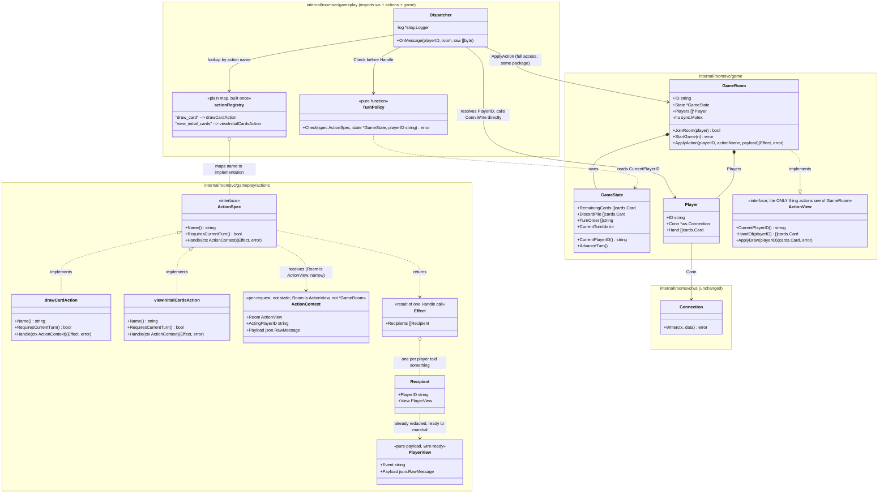

# Gameplay Dispatch & Turn Policy — LLD

> **Status: implemented.** `view_initial_cards` and `draw_card` are built,
> tested, and wired into `cmd/roomsvc/main.go`'s `onConnect`, matching the
> design below. Referenced from `ARCHITECTURE.md` rather than duplicated
> there — see that file's `gameplay`/`gameplay/actions` section. Update
> this document (not a copy of it) when the design changes; more actions
> (discard, swap, call Cabo) will extend it in place as they're built.

## 1. Problem

`handoff.Handle` hands a connection into `Connection.ReadLoop`, but
`onMessage` is unwired for post-handoff traffic — nothing yet turns a
player's next WebSocket message into a game action. This LLD covers only
that gap: reading one message, deciding whether the sender may do what
they're asking, and applying the effect to `GameState`.

Three constraints shape this design, and none of them are optional:

1. **Turn order exists but is not exclusive.** There is a current-turn
   player, but Cabo allows out-of-turn reactions (e.g. a snap/slap on a
   discard) from *other* players during someone else's turn. A single "is
   it my turn" gate on every action is wrong.
2. **Players do not know their own hand.** `Player.Hand` is authoritative
   server state, not player knowledge. Only one action — a one-time
   initial peek — is allowed to reveal any of it back to its owner. Every
   other response must never leak `Hand` contents to the player who owns
   them.
3. **Backend is authoritative.** No client-sent state is trusted; every
   action must be validated server-side before it mutates `GameState`.

## 2. Design principles applied

**Layer above, don't bolt onto.**
`ws` doesn't know `game`; `cards` doesn't know `game`; `handoff` sits above
both without either depending back on it — this is the Dependency
Inversion shape the repo already committed to. A new `gameplay` package
follows the same rule: it sits above `ws` and `game`, rather than growing
`GameRoom` into a method bag. `GameRoom` stays a state owner; `gameplay`
owns the policy of what incoming messages are allowed to do to that state.

**Open/closed dispatch.**
Every action declares its own turn requirement as data, not as a
copy-pasted `if` at the top of each handler. Adding a new action means
adding one registry entry and one handler function — the dispatcher's
validation path is never touched. This is what makes "some actions check
turn, some don't" cheap instead of a source of drift between handlers.

**Read-gating as its own concern.**
"Don't tell a player their own hand" is a response-shaping rule, not a
state rule. It is enforced in exactly one place — a view builder that
redacts `Hand` per recipient — rather than trusted to every handler to
remember individually. A handler that forgets to redact is a bug class
this design tries to make structurally hard to write.

**One lock, already established.**
`GameRoom.mu` already guards `Players` and `started` (see `JoinRoom`,
`StartGame`). New mutable state this needs (whose turn it is, the discard
pile) lives under that same lock, not a second lock — two locks on one
struct is a deadlock risk taken on for no benefit here.

## 3. Class diagram

Revised after discussion. Key changes from the first draft:

- `ActionSpec` is now an **interface**, one small implementing type per
  action (e.g. `drawCardAction`), not a struct instance held in a table.
- `ActionRegistry` collapsed to a **plain `map[string]ActionSpec` literal**,
  built once at package init — no `Register` method, since the action set
  is fixed at compile time, not extended at runtime.
- `PlayerView` is now **pure payload** — exactly the JSON that gets
  written to one recipient's connection, nothing else. All redaction
  *reasoning* (which cards are safe for this recipient to see, for this
  event) stays local to the action's own `Handle`; no intermediate
  "visibility" field survives into the struct that gets sent.
- `ActionContext` stays **per-request data** (not static, not an enum) —
  it's different on every call: whichever room, whichever acting player,
  whichever payload bytes. The static, one-per-action-type behavior lives
  in `ActionSpec`'s implementing types instead.
- **Package boundary is now the real security boundary, not just
  convention.** `ActionContext.Room` is typed as `ActionView` (a narrow
  interface, defined in `game`, implemented by `*GameRoom`) instead of the
  raw `*GameRoom`. `GameRoom.Players []*Player` is exported today — a
  `*GameRoom` handed to an action would expose `.Players[i].Conn.Write(...)`
  regardless of which package the action lives in, since Go only blocks
  *importing a package's types by name*, not calling exported methods
  reached through another type. `ActionView` exposes only the handful of
  read/mutate operations an action legitimately needs (e.g. "whose turn is
  it," "draw a card for this player ID") — never `Players`, never
  `*ws.Connection`. Combined with `actions` not importing `ws` at all, this
  makes "an action cannot write to a socket" a compiler-enforced fact, not
  a convention someone can forget.

**Why `actions` cannot reach a `Connection`, concretely:**
`internal/roomsvc/gameplay/actions` never imports `internal/roomsvc/ws`.
Every action's `Handle` only ever holds an `ActionContext`, whose `Room`
field is `ActionView` — an interface with three narrow methods, none of
which returns a `*Player` or `*ws.Connection`. There is no value reachable
from inside `Handle` that has a `.Conn` or `.Write` on it. This is checked
by the Go compiler at build time, not by code review discipline.
`Dispatcher`, in the `gameplay` package, is the only place that imports
both `ws` and `game`/`actions` together, and is therefore the only place
in the entire gameplay path allowed to call `.Conn.Write`.

## 4. Flow of one message

1. `ws.Connection.ReadLoop` receives a frame, calls
   `Dispatcher.OnMessage(playerID, room, raw)` — the wiring point in
   `onConnect`, mirroring how `onClose` is wired today.
2. `Dispatcher` unmarshals just the `action` field, looks it up in the
   plain `actionRegistry` map. Unknown action → error reply, nothing
   touched.
3. `TurnPolicy.Check` runs only if `ActionSpec.RequiresCurrentTurn()` is
   true — an out-of-turn reaction action simply returns `false` from that
   method and skips the check entirely, no branch needed in the dispatcher
   itself.
4. On pass, `GameRoom.ApplyAction` takes `mu`, calls the matched
   `ActionSpec`'s `Handle(ctx ActionContext)`, mutates `GameState`/
   `Player.Hand`, returns an `Effect` — all under the existing lock, same
   discipline as `StartGame`. `Handle` is a pure function: it reads and
   mutates state and returns a description of the outcome, but never
   writes to any connection itself.
5. `Effect.Recipients` is a list of `{PlayerID, PlayerView}` pairs. Each
   `PlayerView` was already built, per recipient, by whatever
   event-specific logic lives inside that action's `Handle` — deciding
   which cards are safe to reveal to *this* recipient for *this* event is
   done there, not carried as extra fields on `PlayerView` itself.
   `PlayerView` is nothing more than the final JSON payload.
6. Only now does the `Dispatcher` resolve each `Recipient.PlayerID` to a
   live `*Player` (via `room.Players`) and call `.Conn.Write` — this is the
   **only** place a live connection is touched. Handlers never see a
   `*Player`, only an ID; this keeps `Handle` unit-testable without a real
   socket, and keeps "who actually gets bytes written to them" as one
   chokepoint instead of something every action re-implements.

**Open question — needs a decision:** should an out-of-turn action be
allowed to run concurrently with the current player's in-progress turn
action, or does `GameRoom.mu` simply serialize them (whoever's goroutine
reaches the lock first wins, no queueing)? The mutex already gives you the
second option for free. The first needs an explicit ordering rule this LLD
does not yet define, because `cabo.md` lists the snap/slap rule itself as
undecided.

## 5. What this LLD deliberately excludes

| Excluded | Why |
|---|---|
| Actual action list (`draw_card`, `discard`, ...) | Separate decision, not yet made — this LLD is the shape the registry takes, not its contents. |
| Card values / special powers | Undecided in `cabo.md`; `ActionSpec.Handle` bodies depend on this but the interface doesn't. |
| Snap/slap penalty and timing | Undecided in `cabo.md`; only the "not turn-gated" mechanism is provisioned for here. |
| Cross-service wire contract | Listed as Deferred in the shared architecture spine — needs its own decision, recorded the way `handoff`'s contract was. |
